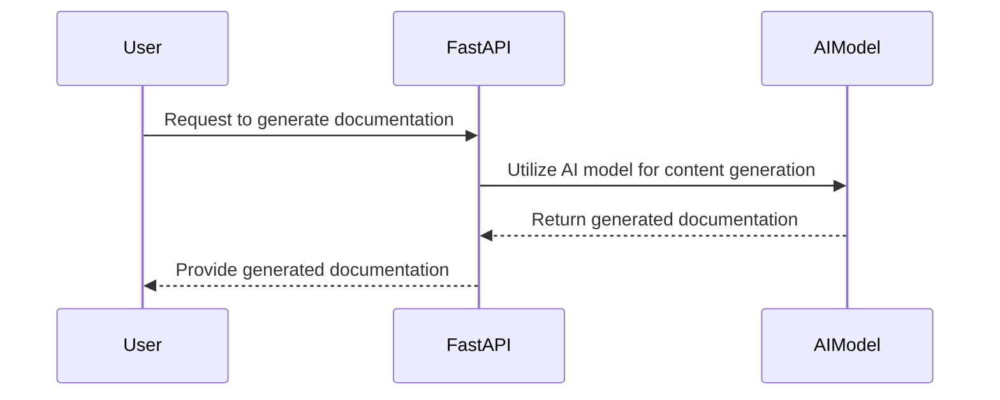
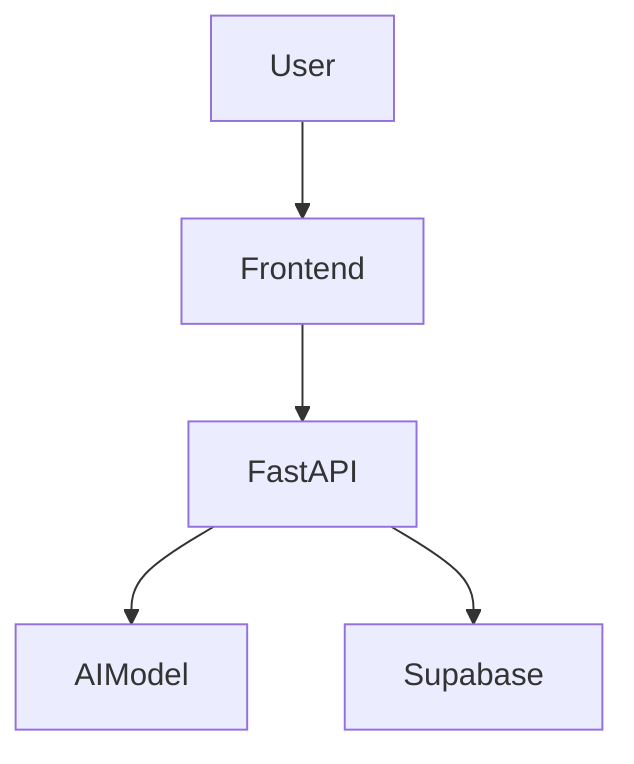

## 🎯 Overall Project Purpose
The project aims to analyze a multi-language codebase along with existing documentation to generate comprehensive documentation formatted as a Markdown file. It involves fetching code from various files, processing it, and utilizing AI models to create detailed documentation.

## 🧩 Module-Level Summaries
1. **index.html**: Contains the basic HTML structure for the project's frontend.
2. **tailwind.config.js**: Configures Tailwind CSS settings for the project.
3. **vite.config.js**: Configures Vite build tool settings for the project.
4. **postcss.config.js**: Configures PostCSS plugins for the project.
5. **app.py**: Python script for analyzing codebase and generating documentation.
6. **activate_venv.py**: Python script to activate a virtual environment.
7. **main.py**: FastAPI script for handling API requests and generating documentation.
8. **index.css**: CSS file for styling the project.
9. **classNames.js**: Utility function for joining CSS class names.
10. **supabase.js**: Handles interactions with Supabase for database operations.

## 🧠 Code Logic and Workflows
The `app.py` script reads code files, chunks them, and combines with existing documentation. It then uses an AI model to generate comprehensive documentation. The `main.py` script uses FastAPI to handle API requests for generating documentation based on GitHub repositories. The `generate_documentation` endpoint fetches code from repositories, processes it, and generates documentation using AI models.

## 📊 Workflow Diagrams

## 🗂️ Architecture Diagram
The project architecture involves frontend (HTML/CSS), backend (FastAPI), AI model integration, and database operations with Supabase.

## 🧬 Service/API Dependency Diagrams

## 🛠️ Database ER Diagrams
No explicit database schema or ORM found in the provided codebase.

## 💡 Best Practices & Improvement Suggestions
- Implement error handling for API requests and file operations.
- Enhance documentation with more detailed explanations of functions and components.
- Use consistent coding styles and naming conventions across files.
- Consider adding unit tests for critical functionalities.
- Include more detailed architecture diagrams for better understanding.