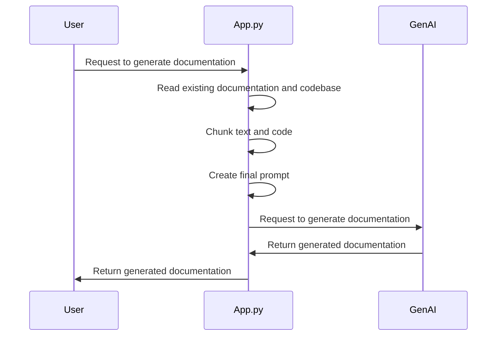
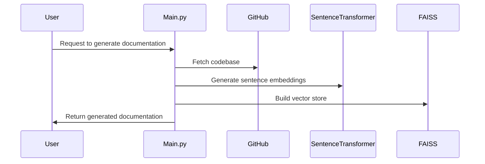
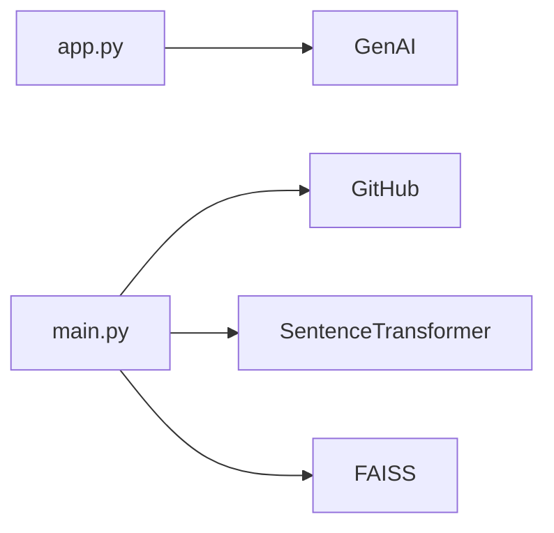

# @ai-docs

## 🎯 Overall Project Purpose

The `@ai-docs` project is a comprehensive documentation generation tool that analyzes a multi-language codebase and generates detailed documentation in Markdown format. It leverages AI to understand the codebase and generate meaningful documentation, including file/module-level details, key functions and components, implementation details, and visual diagrams.

The main problem it solves is the time-consuming and complex task of writing detailed documentation for large codebases. It automates the process of understanding the codebase and generating comprehensive documentation, making it easier for developers to understand the structure and functionality of the codebase.

## 🧩 Module-level Summaries

### index.html

This is the main HTML file that serves as the entry point for the web application. It includes links to the main JavaScript file (`main.jsx`) and stylesheets.

### tailwind.config.js

This is the configuration file for Tailwind CSS, a utility-first CSS framework. It specifies the content files to be scanned for class names, extends the default configuration, and defines plugins.

### vite.config.js

This is the configuration file for Vite, a build tool that provides a faster and leaner development experience for modern web projects. It specifies the plugins to be used, in this case, the React plugin.

### postcss.config.js

This is the configuration file for PostCSS, a tool for transforming CSS with JavaScript. It specifies the plugins to be used, in this case, Tailwind CSS and Autoprefixer.

### app.py

This is the main Python script that generates the comprehensive documentation. It reads the existing documentation and codebase, chunks the text and code, creates the final prompt, and uses the Gemini-2.0-Flash model from GenAI to generate the documentation.

### activate_venv.py

This script activates the Python virtual environment 'venv'. It is designed for Windows systems.

### main.py

This is the main FastAPI application. It provides endpoints for generating documentation and a root endpoint. It uses the SentenceTransformer model for sentence embeddings and FAISS for efficient similarity search.

### index.css

This is the main CSS file for the application. It includes Tailwind CSS directives for base styles, components, and utilities.

### classNames.js

This is a utility function for conditionally joining CSS class names together.

### supabase.js

This file sets up the Supabase client, which provides a backend for the application.

## 🧠 Code Logic and Workflows

The main logic of the application is in `app.py` and `main.py`. 

In `app.py`, the script first reads the existing documentation and codebase. It then chunks the text and code into manageable parts and creates a final prompt that includes the existing documentation and code. This prompt is passed to the Gemini-2.0-Flash model from GenAI, which generates the comprehensive documentation. The generated documentation is then written to a Markdown file.

In `main.py`, the FastAPI application provides an endpoint for generating documentation. It uses the SentenceTransformer model to generate sentence embeddings for the codebase and FAISS for efficient similarity search. It also fetches the codebase from a GitHub repository and builds a knowledge base and vector store for the user.

## 📊 Workflow Diagrams





## 🗂️ Architecture Diagram

```
@ai-docs
│
├── index.html
├── tailwind.config.js
├── vite.config.js
├── postcss.config.js
├── app.py
├── activate_venv.py
├── main.py
├── index.css
├── classNames.js
└── supabase.js
```

## 🧬 Service/API Dependency Diagrams



## 🛠️ Database ER Diagrams

No database schema or ORM was found in the provided codebase.

## 💡 Best Practices & Improvement Suggestions

- Use environment variables or a configuration file to store sensitive information such as API keys.
- Handle exceptions and errors gracefully to provide a better user experience.
- Use meaningful variable and function names to make the code easier to understand.
- Add comments to explain complex code logic.
- Use version control to track changes and collaborate with others.
- Regularly update dependencies to get the latest features and security updates.
- Write tests to ensure the code works as expected.
- Use continuous integration/continuous deployment (CI/CD) to automate the testing and deployment process.