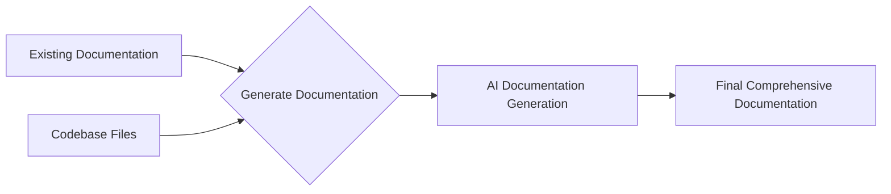

## 🎯 Overall Project Purpose
The project aims to analyze a multi-language codebase along with existing documentation to generate comprehensive documentation in Markdown format. It involves fetching code from various files, processing it, and using AI models to generate detailed documentation.

## 🧩 Module-Level Summaries
1. **index.html**: Contains the basic HTML structure for the project's frontend.
2. **tailwind.config.js**: Configures Tailwind CSS settings for the project.
3. **vite.config.js**: Configuration file for Vite, a frontend build tool.
4. **postcss.config.js**: Configures PostCSS plugins for the project.
5. **app.py**: Python script to analyze codebase, fetch existing documentation, and generate comprehensive documentation using AI.
6. **activate_venv.py**: Python script to activate a virtual environment.
7. **main.py**: FastAPI script to interact with the frontend and generate documentation based on user input.
8. **index.css**: Contains Tailwind CSS styles for the project.
9. **classNames.js**: Utility function to join CSS class names conditionally.
10. **supabase.js**: Sets up a Supabase client for interacting with a database.

## 🧠 Code Logic and Workflows
- **app.py**: Reads existing documentation and code files, chunks them, and creates prompts for AI documentation generation.
- **activate_venv.py**: Activates a virtual environment based on the OS.
- **main.py**: FastAPI script to handle API requests for generating documentation based on user input.
- **supabase.js**: Sets up a client for interacting with a Supabase database.

## 📊 Workflow Diagrams


## 🗂️ Architecture Diagram
```
Project Structure:
- frontend/
  - index.html
  - index.css
- backend/
  - app.py
  - main.py
- scripts/
  - activate_venv.py
- config/
  - tailwind.config.js
  - vite.config.js
  - postcss.config.js
- utils/
  - classNames.js
- database/
  - supabase.js
```

## 🧬 Service/API Dependency Diagrams
```
User Request --> main.py --> AI Model --> Generate Documentation
```

## 🛠️ Database ER Diagrams
No database schema or ORM found in the provided codebase.

## 💡 Best Practices & Improvement Suggestions
- Implement error handling for API requests and file operations in a more robust manner.
- Consider adding unit tests to ensure the functionality of different modules.
- Document codebase with inline comments for better understanding.
- Use consistent coding style and naming conventions across all files.
- Optimize code for better performance, especially in data processing tasks.