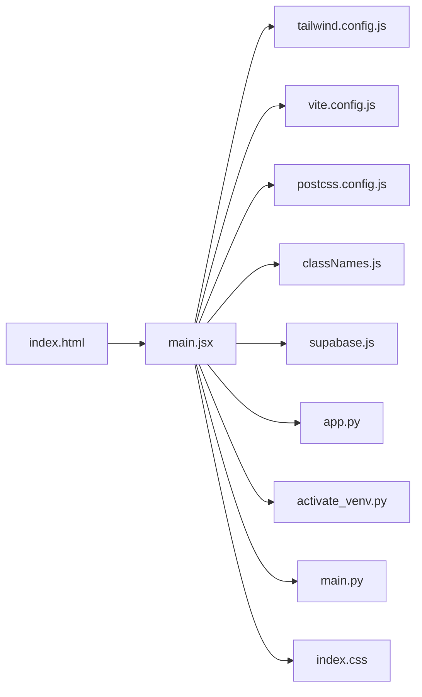
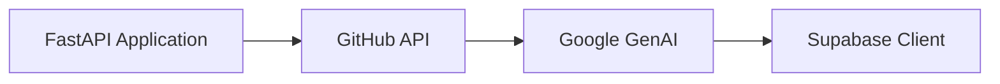

# @ai-docs

## 🎯 Overall Project Purpose

The `@ai-docs` project is a comprehensive documentation generation tool that analyzes a multi-language codebase and generates professional-level documentation in Markdown format. It uses AI models to understand the codebase and create a detailed explanation of the project's structure, functionality, and design decisions. The tool also provides visual diagrams for better understanding of the project's architecture and data flows. This tool solves the problem of time-consuming and complex manual documentation, providing an automated, efficient, and accurate solution.

## 🧩 Module-level Summaries

### HTML File

- `index.html`: The main HTML file that loads the React application. It includes the root div where the React components are rendered and the main script file.

### JavaScript Files

- `tailwind.config.js`: This is the configuration file for Tailwind CSS, a utility-first CSS framework for rapidly building custom user interfaces.
- `vite.config.js`: This is the configuration file for Vite, a build tool that aims to provide a faster and leaner development experience for modern web projects.
- `postcss.config.js`: This is the configuration file for PostCSS, a tool for transforming CSS with JavaScript.
- `classNames.js`: This is a utility function to conditionally join CSS class names together.
- `supabase.js`: This file sets up the Supabase client. Supabase is an open-source Firebase alternative.

### Python Files

- `app.py`: This is the main Python script that generates the documentation using the AI model. It reads the existing codebase and documentation, chunks them into manageable pieces, and feeds them to the AI model to generate the final documentation.
- `activate_venv.py`: This script is used to activate the Python virtual environment.
- `main.py`: This is the main FastAPI application. It includes endpoints for generating documentation and the logic for fetching and processing code from a GitHub repository.

### CSS File

- `index.css`: This file contains the base, components, and utilities styles for the application using Tailwind CSS.

## 🧠 Code Logic and Workflows

The main logic of the project is in the `app.py` and `main.py` files.

In `app.py`, the script starts by reading any existing documentation and codebase. It then chunks these into manageable pieces and creates a final prompt that includes both the existing documentation and codebase. This prompt is then fed to the AI model, which generates the final documentation. The generated documentation is then written to a Markdown file.

In `main.py`, the FastAPI application is set up with CORS middleware. It includes an endpoint for generating documentation. When this endpoint is hit, it fetches the codebase from a GitHub repository, builds a knowledge base and vector store for the user, and then uses the AI model to generate the documentation.

## 📊 Workflow Diagrams

## 🗂️ Architecture Diagram

## 🧬 Service/API Dependency Diagrams

## 🛠️ Database ER Diagrams

There is no database schema or ORM found in the provided codebase.

## 💡 Best Practices & Improvement Suggestions

1. **Code Organization**: The codebase could benefit from a more structured organization. For instance, the Python scripts could be organized into separate directories based on their functionality.

2. **Error Handling**: The codebase could improve its error handling. Currently, the codebase prints the error message and continues execution. It would be better to handle these errors and decide whether to continue execution based on the severity of the error.

3. **Code Comments**: The codebase lacks comments in some areas. Adding comments would make the code easier to understand and maintain.

4. **Environment Variables**: The codebase uses environment variables, which is a good practice. However, it would be better to have a separate file that loads these variables and provides default values if they are not set.

5. **Testing**: The codebase could benefit from unit tests and integration tests to ensure that the code is working as expected.

6. **Continuous Integration/Continuous Deployment (CI/CD)**: The project could benefit from a CI/CD pipeline for automated testing and deployment.

7. **Security**: The project could improve its security by encrypting sensitive data and using secure protocols for data transmission.