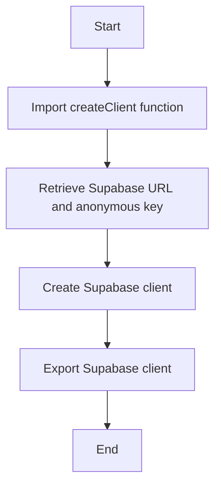

## 🎯 Overall Project Purpose
The `supabase.js` file in the project serves the purpose of initializing and exporting a Supabase client using the `@supabase/supabase-js` library. Supabase is an open-source Firebase alternative that provides a real-time database and authentication services.

## 🧩 Module-level Summaries
- `supabase.js`: Initializes and exports a Supabase client using the Supabase library.

## 🧠 Code Logic and Workflows
The code in `supabase.js` imports the `createClient` function from the `@supabase/supabase-js` library. It then retrieves the Supabase URL and anonymous key from the environment variables using Vite's `import.meta.env` feature. Finally, it creates a Supabase client using the retrieved URL and key, and exports it for use in other parts of the project.

## 📊 Workflow Diagram

## 💡 Best Practices & Improvement Suggestions
- Ensure that sensitive information such as Supabase URL and keys are securely stored and accessed.
- Consider adding error handling and logging to the Supabase client initialization process.
- Document any additional configuration options or customizations that can be made to the Supabase client.

This documentation provides an overview of the `supabase.js` file in the project, explaining its purpose, functionality, and potential areas for improvement.