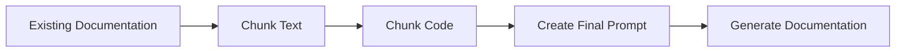

## 🎯 Overall Project Purpose

The project aims to analyze a multi-language codebase along with any existing documentation provided and generate comprehensive documentation formatted as a Markdown file. The generated documentation includes an overview of the project's goals, architectural structure, file/module-level details, key functions/components, implementation details, and visual diagrams.

## 🧩 Module-Level Summaries

### `index.html`
- Purpose: HTML file for the project's main page.
- Functionality: Defines the structure of the main page with links to CSS and JavaScript files.
  
### `tailwind.config.js`
- Purpose: Configuration file for Tailwind CSS.
- Functionality: Defines Tailwind CSS content and theme configurations.

### `vite.config.js`
- Purpose: Configuration file for Vite.
- Functionality: Configures Vite plugins for the project.

### `postcss.config.js`
- Purpose: Configuration file for PostCSS.
- Functionality: Configures PostCSS plugins for the project.

### `app.py`
- Purpose: Python script for generating comprehensive documentation.
- Functionality: Reads existing documentation and code, chunks text/code, generates prompts, and uses Gemini API for documentation generation.

### `activate_venv.py`
- Purpose: Python script for activating a virtual environment.
- Functionality: Activates the virtual environment in the current directory.

### `main.py`
- Purpose: FastAPI script for interacting with GitHub repositories.
- Functionality: Fetches repository details, builds vector stores, and generates documentation based on user input.

### `index.css`
- Purpose: CSS file for styling the project.
- Functionality: Contains Tailwind CSS directives.

### `classNames.js`
- Purpose: JavaScript utility for joining CSS class names.
- Functionality: Conditionally joins CSS class names together.

### `supabase.js`
- Purpose: JavaScript file for interacting with Supabase.
- Functionality: Creates a Supabase client for database operations.

## 🧠 Code Logic and Workflows

The `app.py` script reads existing documentation and code, chunks them, creates prompts, and uses the Gemini API to generate comprehensive documentation. The `main.py` script interacts with GitHub repositories, fetches details, builds vector stores, and generates documentation based on user input.

## 📊 Workflow Diagrams

## 🗂️ Architecture Diagram

The architecture involves HTML, CSS, JavaScript, Python scripts, and API interactions for documentation generation.

## 🧬 Service/API Dependency Diagrams

Not applicable in the provided codebase.

## 🛠️ Database ER Diagrams

Not applicable in the provided codebase.

## 💡 Best Practices & Improvement Suggestions

- **Modularization**: Consider breaking down the functionality into smaller, more manageable modules.
- **Error Handling**: Enhance error handling mechanisms to provide more informative messages to users.
- **Documentation**: Include inline comments and documentation to improve code readability.
- **Testing**: Implement unit tests to ensure the reliability of the codebase.
- **Security**: Implement proper security measures, especially when interacting with external APIs and repositories.