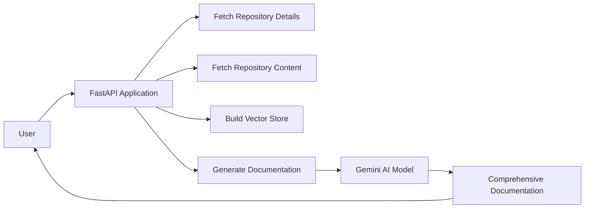
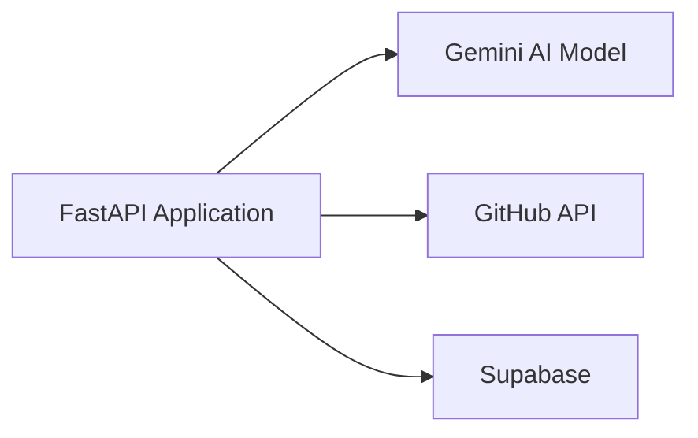

# @ai-docs

## 🎯 Overall Project Purpose

The `@ai-docs` project is a comprehensive code documentation generator. It uses AI to analyze a given codebase and existing documentation, and then generates a detailed, professional-level documentation in Markdown format. This documentation includes an overall project overview, file/module-level details, key functions/components, implementation details, and visual diagrams. This project helps developers to understand the structure, logic, and workflows of a codebase without having to manually read through the entire code.

## 🧩 Module-level Summaries

### index.html

This is the main HTML file that serves as the entry point of the web application. It includes references to the main JavaScript file (`main.jsx`) and CSS files.

### tailwind.config.js

This is the configuration file for Tailwind CSS, a utility-first CSS framework. It specifies the content files, theme extensions, and plugins used in the project.

### vite.config.js

This is the configuration file for Vite, a build tool that provides a faster and leaner development experience for modern web projects. It specifies the plugins used in the project.

### postcss.config.js

This is the configuration file for PostCSS, a tool for transforming CSS with JavaScript. It specifies the plugins used in the project.

### app.py

This is the main Python script that generates the comprehensive documentation. It reads the existing documentation and codebase, chunks them into manageable parts, creates a final prompt, and uses the Gemini AI model to generate the documentation.

### activate_venv.py

This script activates the Python virtual environment. It is designed to work on Windows systems.

### main.py

This is the main FastAPI application. It includes endpoints for generating the documentation and a root endpoint. It also includes functions for fetching repository details and content, and building a vector store for sentence embeddings.

### index.css

This is the main CSS file for the web application. It includes Tailwind CSS directives for base styles, components, and utilities.

### classNames.js

This is a utility function for joining CSS class names together.

### supabase.js

This script initializes the Supabase client, which is used for interacting with the Supabase backend.

## 🧠 Code Logic and Workflows

The main logic of the project is implemented in `app.py` and `main.py`. `app.py` reads the existing documentation and codebase, chunks them into manageable parts, creates a final prompt, and uses the Gemini AI model to generate the documentation. `main.py` is a FastAPI application that includes endpoints for generating the documentation and a root endpoint. It fetches repository details and content, and builds a vector store for sentence embeddings.

The web application is built with Vite and Tailwind CSS. The main HTML file (`index.html`) serves as the entry point of the application. It includes references to the main JavaScript file (`main.jsx`) and CSS files. The Tailwind CSS configuration is specified in `tailwind.config.js`, and the Vite configuration is specified in `vite.config.js`. The main CSS file (`index.css`) includes Tailwind CSS directives for base styles, components, and utilities.

The `classNames.js` utility function is used for joining CSS class names together. The `supabase.js` script initializes the Supabase client, which is used for interacting with the Supabase backend.

## 📊 Workflow Diagrams



## 🗂️ Architecture Diagram

```
@ai-docs
│
├── index.html
├── tailwind.config.js
├── vite.config.js
├── postcss.config.js
├── app.py
├── activate_venv.py
├── main.py
├── index.css
├── classNames.js
└── supabase.js
```

## 🧬 Service/API Dependency Diagrams



## 💡 Best Practices & Improvement Suggestions

1. **Error Handling**: The current implementation lacks comprehensive error handling. It's recommended to add more try-catch blocks and error checking to ensure the application can handle unexpected situations gracefully.

2. **Code Organization**: Some functions in `app.py` and `main.py` are quite long and do multiple things. It would be better to break these functions down into smaller, single-responsibility functions.

3. **Code Comments**: While the code is generally well-written, it could benefit from more comments explaining what each part of the code does. This would make it easier for other developers to understand the code.

4. **Environment Variables**: Sensitive data such as API keys are currently stored in environment variables, which is a good practice. However, it would be better to use a more secure method for storing these keys, such as a secrets manager.

5. **Testing**: The project currently lacks tests. It's recommended to add unit tests, integration tests, and end-to-end tests to ensure the application works as expected and to catch any regressions in future updates.

6. **Continuous Integration/Continuous Deployment (CI/CD)**: Implementing a CI/CD pipeline would automate the testing and deployment process, making it easier to maintain and update the application.