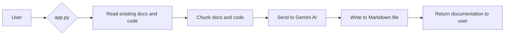
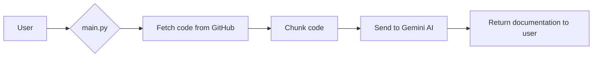
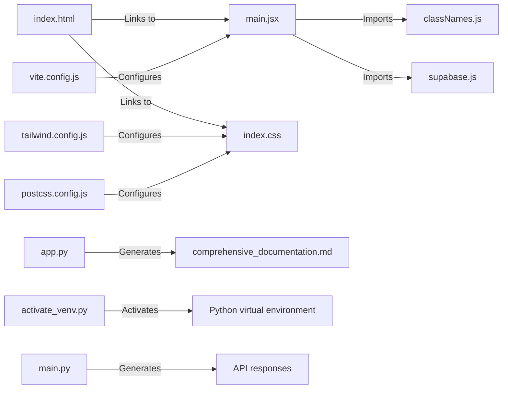
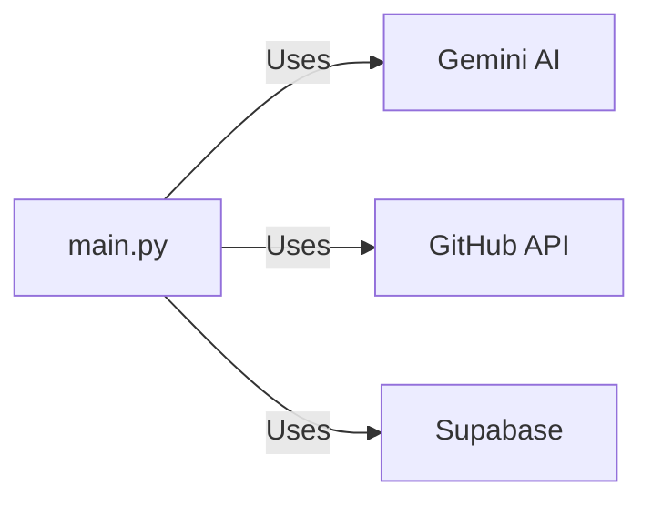

# @ai-docs

## 🎯 Overall Project Purpose

The @ai-docs project is a comprehensive tool designed to automatically generate professional-level documentation for a given codebase. The generated documentation is formatted as a Markdown file and includes an overall overview of the project, file/module-level details, key functions and components, implementation details, and visual diagrams. The project aims to solve the problem of time-consuming and often overlooked task of writing detailed and accurate documentation for software projects.

## 🧩 Module-level Summaries

### index.html

This is the main HTML file that serves as the entry point for the web application. It includes links to the main JavaScript file (`main.jsx`) and the CSS files. It also sets up the root div where the React application will be mounted.

### tailwind.config.js

This is the configuration file for Tailwind CSS, a utility-first CSS framework. It specifies where to find the HTML and JavaScript files that use the CSS classes. It also extends the default configuration to add custom animations and font families.

### vite.config.js

This is the configuration file for Vite, a build tool and development server. It specifies that the React plugin should be used.

### postcss.config.js

This is the configuration file for PostCSS, a tool for transforming CSS. It specifies that the Tailwind CSS and Autoprefixer plugins should be used.

### app.py

This is the main Python script that generates the documentation. It reads the existing documentation and code, chunks them into manageable parts, and sends them to the Gemini AI model to generate the documentation.

### activate_venv.py

This is a utility script to activate a Python virtual environment. It is designed for Windows systems.

### main.py

This is the main script for a FastAPI application. It sets up the API endpoints and handles the logic for generating the documentation, including fetching the code from a GitHub repository, chunking it, and sending it to the Gemini AI model.

### index.css

This is the main CSS file for the application. It imports the base, components, and utilities from Tailwind CSS.

### classNames.js

This is a utility function for joining CSS class names together. It is used in the React components to conditionally apply classes.

### supabase.js

This is the configuration file for Supabase, a backend-as-a-service provider. It sets up the client with the Supabase URL and anonymous key.

## 🧠 Code Logic and Workflows

The main logic of the application is handled by the `app.py` and `main.py` scripts. 

In `app.py`, the existing documentation and code are read from the file system. The code is chunked into manageable parts and sent to the Gemini AI model to generate the documentation. The generated documentation is then written to a Markdown file.

In `main.py`, a FastAPI application is set up with two endpoints. The `/generate_documentation` endpoint handles the logic for generating the documentation. It fetches the code from a GitHub repository, chunks it, and sends it to the Gemini AI model to generate the documentation. The generated documentation is then returned as a response. The `/` endpoint simply returns a "Hello World" message.

The `activate_venv.py` script is a utility script to activate a Python virtual environment. It is designed for Windows systems.

The `index.html`, `index.css`, `tailwind.config.js`, `vite.config.js`, and `postcss.config.js` files handle the frontend of the application. They set up the HTML structure, CSS styles, and build configuration.

The `classNames.js` and `supabase.js` files are utility scripts. `classNames.js` provides a function for joining CSS class names together, and `supabase.js` sets up the Supabase client.

## 📊 Workflow Diagrams

## 🗂️ Architecture Diagram

## 🧬 Service/API Dependency Diagrams

## 🛠️ Database ER Diagrams

No database schema or ORM found in the provided codebase.

## 💡 Best Practices & Improvement Suggestions

1. **Error Handling:** The codebase could benefit from more robust error handling. For example, the `app.py` script could catch exceptions when reading the existing documentation and code, and provide more informative error messages.

2. **Code Organization:** The codebase could be better organized by separating the logic for reading the existing documentation and code, chunking the text, and generating the documentation into separate functions or classes.

3. **Code Comments:** The codebase could benefit from more comments explaining the purpose and functionality of each part of the code.

4. **Testing:** The codebase currently lacks tests. Adding unit tests and integration tests would help ensure the code is working as expected and make it easier to catch and fix bugs.

5. **Security:** The `main.py` script uses an environment variable for the GitHub token. This is a good practice for keeping sensitive information out of the code, but it would be even better to use a more secure method of storing and accessing this token, such as a secrets manager.

6. **Performance:** The `app.py` script reads the entire existing documentation and code into memory before chunking it. This could be inefficient for large codebases. A more efficient approach would be to read and chunk the text in a streaming manner.