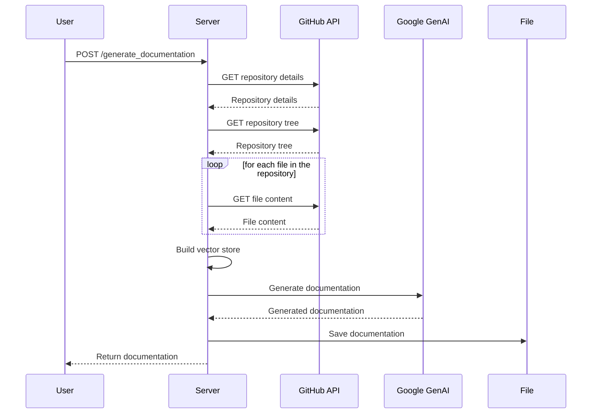
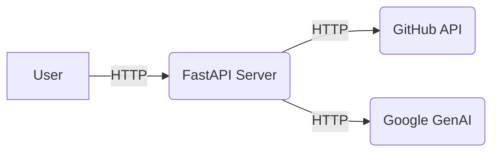

# @ai-docs

## 🎯 Overall Project Purpose

The `@ai-docs` project is a comprehensive documentation generation tool. It is designed to analyze a multi-language codebase and any existing documentation, then generate a detailed and structured documentation in Markdown format. The generated documentation includes an overall overview of the project, file/module-level details, key functions and components, implementation details, and visual diagrams. 

The project uses a variety of technologies including Python, FastAPI, JavaScript, React, Tailwind CSS, and Vite. It also integrates with the Google GenAI service for AI-powered content generation, and Supabase for potential database operations.

## 🧩 Module-Level Summaries

### `index.html`

This is the main HTML file that serves as the entry point for the web application. It includes references to the main JavaScript file (`main.jsx`) and the CSS files.

### `tailwind.config.js`

This file contains the configuration for Tailwind CSS, a utility-first CSS framework. It specifies the paths to the HTML and JavaScript files where the CSS classes are used, and extends the default configuration with custom animations and font families.

### `vite.config.js`

This file configures Vite, a build tool and development server. It includes the React plugin for handling React components.

### `postcss.config.js`

This file configures PostCSS, a tool for transforming CSS with JavaScript. It includes the Tailwind CSS and Autoprefixer plugins.

### `app.py`

This Python script generates the final documentation by analyzing the existing codebase and any existing documentation. It uses the Google GenAI service to generate the documentation content.

### `activate_venv.py`

This Python script activates a Python virtual environment. It is designed for Windows systems.

### `main.py`

This Python script is the main application server, built with the FastAPI framework. It includes endpoints for generating documentation and a simple root endpoint. It also fetches code from a GitHub repository, builds a knowledge base and a vector store for the code, and uses the Google GenAI service to generate the documentation.

### `index.css`

This CSS file imports the base, components, and utilities styles from Tailwind CSS.

### `classNames.js`

This JavaScript module exports a utility function for conditionally joining CSS class names together.

### `supabase.js`

This JavaScript module initializes a Supabase client with the Supabase URL and anonymous key from the environment variables. Supabase is an open-source Firebase alternative.

## 🧠 Code Logic and Workflows

The main workflow of the project is as follows:

1. The user sends a request to the `/generate_documentation` endpoint with a GitHub repository URL and their email.
2. The server fetches the details of the repository and its file tree from the GitHub API.
3. For each file in the repository, the server fetches its content and adds it to the user's knowledge base and a list of all chunks of code.
4. The server builds a vector store from all chunks of code using the SentenceTransformer model for sentence embeddings and the FAISS library for efficient similarity search.
5. The server generates the final documentation by sending a prompt to the Google GenAI service with the base prompt and all chunks of code as the context.
6. The server saves the generated documentation to a file and returns it in the response.

## 📊 Workflow Diagrams



## 🗂️ Architecture Diagram

```
@ai-docs
├── index.html
├── tailwind.config.js
├── vite.config.js
├── postcss.config.js
├── app.py
├── activate_venv.py
├── main.py
├── index.css
├── classNames.js
└── supabase.js
```

## 🧬 Service/API Dependency Diagrams



## 💡 Best Practices & Improvement Suggestions

- Use environment variables for sensitive data like API keys, and don't include them in the code or version control.
- Handle exceptions and errors gracefully, and provide informative error messages to the user.
- Use a consistent coding style and follow best practices for each language and framework.
- Write clear and concise comments to explain complex or important parts of the code.
- Use meaningful variable and function names that describe their purpose.
- Break down complex functions into smaller, more manageable functions.
- Use version control and regularly commit changes.
- Write tests to ensure the code works as expected and to catch bugs early.
- Keep dependencies up to date to benefit from bug fixes and improvements.
- Consider using a linter to enforce a consistent coding style and catch potential issues.
- Consider using a formatter to automatically format the code in a consistent way.
- Consider using a type checker for JavaScript code to catch type errors.
- Consider adding a README file with instructions on how to set up and run the project.
- Consider adding a CONTRIBUTING file with guidelines for contributing to the project.
- Consider adding a LICENSE file to specify the terms under which others can use or contribute to the project.